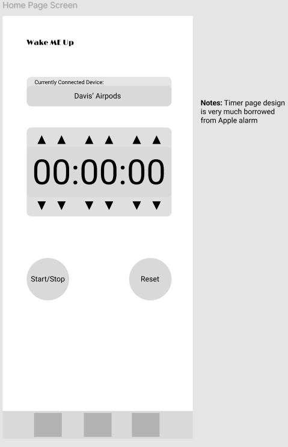
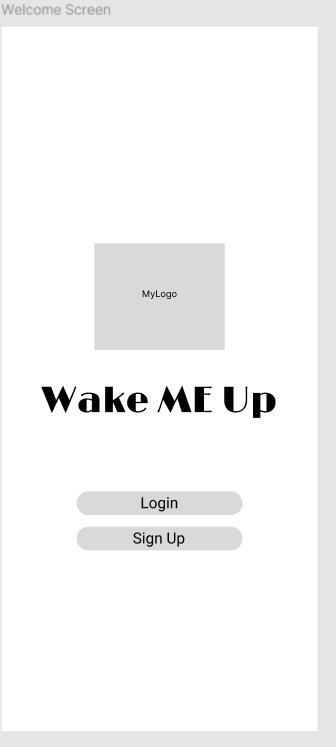
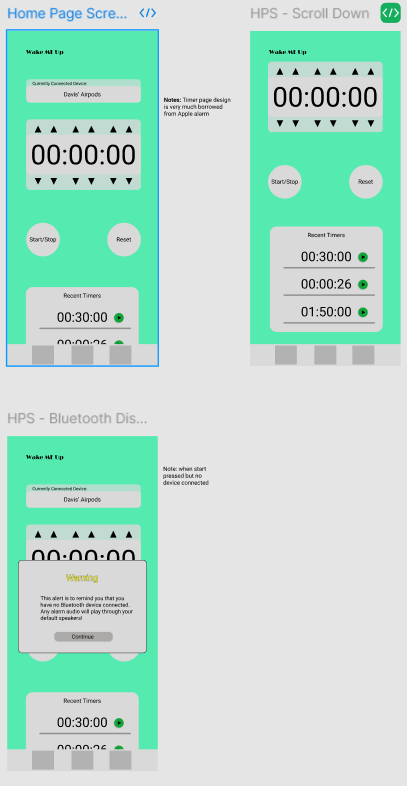

# Mobile-Application-545
Project Name: Wake ME up
By Davis Zhong, Aylin Onalan, Nicola Mihai 
Version #1  
 

1. I intend for the final project to be runnable on an Android device, but potentially also be runnable on an iOS device. Ideally my application would be functional on my personal iPhone but I've had trouble doing this in the past with my currently planned project structure so I will at least make it functional on virtual Android emulators and see if I can move it to my iPhone at a later time.
2. I intend to use TypeScript and React Native on VSCode to develop my application but may continue to do research on if there is a better framwork me to use. This is the structure that I have developed with before but I am actively looking for a different perhaps more robust or convenient way to achieve my goal.
3. I want to explore cross-platform development as I will be developing from a Windows computer for a iOS device but if I come across limitations I may decide to stick to virtual Android emulators to run my project until I find a better solution.

## Summary of Project
*(Base this summary on the pitch)*  
Our project aims to develop a non-intrusive alarm system that personalizes wake-up alerts using existing Bluetooth devices like AirPods and wireless headphones. By offering a peaceful and effective way to wake up without disturbing others, we enhance the morning routine for users in shared living spaces or sensitive environments.
## Project Analysis
### Value Proposition 
*(What are the pain points or problems you’re addressing?  For whom?  If possible, cite facts that support your claim that these are real pain points/problems to address)*  
We address the pain points of waking up aggressively in shared living situations, which can disrupt the sleep of others and create stress. With 83% of adults using wireless earbuds (Statista, 2024), our solution caters to this growing demographic, providing a gentle, personalized wake-up experience that fosters a peaceful environment.
### Primary Purpose
*(Summarize the purpose of the project – could be something focused on the benefit of the target audience, your customers, your “company,” or even public good)*  
The primary purpose of this project is to enhance the morning routines of users by providing a quiet and effective way to wake up. This app is focused on benefiting individuals who live in shared spaces, allowing them to rise without causing disturbances.
### Target Audience
*(State your target demographic, be as specific as you can.  Why are you targeting this demographic?  How do you plan you reach it?)*  
Our target audience includes adults aged 18-45 who live in shared apartments or homes and use wireless earbuds. We are targeting this demographic because they value personal space and quiet environments. To reach them, we will utilize social media marketing, collaborations with lifestyle influencers, and targeted ads highlighting the app's unique benefits.
### Success Criteria
*(How will you know whether your app was successful?  Financial gain?  User satisfaction?  Market share?  Public good?  How will you measure success?)*  
Success will be measured through user satisfaction surveys, download metrics, and user engagement analytics. Financial success will be gauged by in-app purchases and subscription models. Additionally, we will track the app's ratings and feedback in app stores to ensure it meets user expectations.
### Competitor Analysis
*(Summarize strengths/weaknesses of your competitors as compared to you – does not have to be in-depth, focus on things that relate directly to your purpose and value prop)*  
Competitors may include traditional alarm clock apps and smart alarm systems. However, our strengths lie in personalized alerts through existing Bluetooth devices, offering a seamless user experience. Competitors often lack the non-intrusive, customizable features that we provide. Weaknesses of competitors include high costs and complex setups that may not suit users looking for simplicity.
### Monetization Model
*(Briefly propose a monetization model)*  
We propose a freemium model, offering basic alarm functionalities for free while charging for premium features like advanced alarm customization, additional sound options, and the ability to integrate with smart home devices.
### Initial Design
*The purpose of this section is to define the “Minimum Viable Product” (MVP).  It may also be useful to call out the scope and expected/known limitations for your product here.*  
The Minimum Viable Product (MVP) will focus on essential features: the ability to set alarms, play audio alerts through Bluetooth devices, and customize alert tones. Expected limitations include initial support for only specific audio formats and potential connectivity issues with some Bluetooth devices.

### UI/UX Design
(Call out important UI/UX components to have an MVP – does not have to be polished, but should keep the audience, purpose, and value prop in mind)  

### Technical Architecture
(What are the necessary components to support an MVP?  Data structures?  Storage considerations?  Web/cloud interactions?  Be sure to put in some thoughts as to how to measure your success here.  Call out dependencies on 3rd party services/APIs here, too)    
**Necessary components for the MVP include:**
- **Data Structures:** Alarm configurations (time, sound, repeat settings).
- **Storage Considerations:** Local storage for user preferences and alarm data.
- **Web/Cloud Interactions:** Optional cloud storage for syncing alarms across devices.
- **Dependencies:** Use of native audio playback libraries and Bluetooth APIs.    

**Most important and basic design for the MVP would be:**  
- Well designed timer that counts down from user’s specified amount of time.
- Instructions for the user to already have a bluetooth device linked via their phone’s speaker system.
- Well designed home page that has all of this setup
Audio file playing that plays to system default speaker.
- Local storage for application state and user preferences (volume, audio file).
- The MVP is successful if the timer counts down to zero from user input time and plays audio through connected bluetooth device.     

### Challenges and Open Questions
*Identify technical challenges that may come up (e.g. hardware limitations, access to data/services, performance issues, etc.) and propose some solutions to the identified challenges.  Also include questions on matters that you are unsure/unclear about that requires feedback from peers, users, or additional research.*  
One of the issues that we will likely encounter has to do with cross platform development as a whole and more specifically when we attempt to run the app on iOS while we are doing development exclusively on Windows. Necessary tools for iOS such as Xcode are only available for macOS so at some point we will need to experiment with the possibility of a virtual machine or emulator. One of our team members has access to an older mac that we could potentially try using, however that is an untested pathway and could end up not working. A third potential solution is to use one of the iMacs available in the computer science graduate lab, however, those will likely come with their own limitations and challenges regarding necessary software installation. Permissions for accessing the phone’s default audio system will also present a challenge. Especially because of our intent to develop cross platform. differences between iOS and Android systems and how they expect permissions to be requested could cause errors. Using react native libraries like react-native-permissions can help manage permissions across the two platforms more consistently. Another challenge we are likely to have is knowing when a bluetooth device is connected to the system. We need to know this as our alarms should only ring through headphones and not the phone’s main speakers. This will be different between the two systems and we will need to handle both appropriately. We will need to detect bluetooth connection events and also figure out how to route audio properly so it is only audible through headphones. Data storage will also be a challenge that is made more difficult because of the difference between iOs and Android. For credentials we could use something like react-native-keychain as it is cross platform compatible and uses encryption. SQLite Databases are supported within react native and are cross platform compatible as well as being capable of supporting more storage. Dependencies will also be a challenge especially for us developing in a group. React native has you add dependencies through the command line and we should track these in comments at the top of our code. Finally, developing this application in a team will present its own set of challenges. We believe these can be solved by having frequent meeting where we assign work and discuss any problems we are having. Obviously we will also be using a source code repository to track changes to aid in our workflow. Finally, setting expectations of each member and what work they are going to be doing. 
As for questions that require additional research or potential feedback from peers, we are curious as to if they would be interested in our application having an account associated with it so that alarms would be saved. Additionally, if we were to use the cloud for such a feature, how would we manage this in our cross platform application? This will require additional research. We also have the question of how multiple bluetooth device playback would work? Is that something that is possible cross platform? And for our peers, is that a feature that would even be desirable? We also need to do more research on how to implement this application to run in the background since it’s an alarm application that would likely be beneficial.

## Initial Mockup

 

The end-to-end user experience for the personal alarm system begins when the user opens the app, where they are greeted with a clean, responsive interface. The first step is connecting to a Bluetooth device, which is central to the app's value proposition of providing personal alarms through headphones to avoid disturbing others. The process of connecting is seamless, with clear feedback indicating a successful connection. Next, the user sets a timer using an intuitive time picker, ensuring that input is straightforward and error-free. Upon starting the timer, visual or audio feedback confirms that it is running, with the remaining time clearly displayed on the screen. If desired, the user can opt to repeat the timer for recurring alarms, with settings that are easy to toggle. When the timer reaches zero, the alarm goes off through the connected Bluetooth device, delivering the alarm sound directly to the user’s headphones. The entire flow prioritizes simplicity, focusing on delivering value by ensuring reliable and non-intrusive alarms, aligning with clear success criteria such as fast app performance, smooth Bluetooth connectivity, and customizable alarm settings.

## Initial Prototype

**Necessary Features for Minimum Viable Product (MVP):**

*Alarm Creation and Management*
- User should be able to set alarm with a customizable time 
- User should be able to enable or disable alarm

*Alarm Notification and Sound*
- Application plays sound when alarm goes off
- Ensure sound only plays through connected wireless headphones
- Dismiss alarm option for users

*User Settings*
- Configure alarm volume
- Manage general app settings, such as enabling/disabling app settings

*User Interface*
- Simple and intuitive UI for setting alarms
- List of recently used alarms
- Timer-based view for upcoming alarm

*Persistent Storage*
- Save alarms locally so they remain active after the application restarts
- Save user preferences, including alarm volume

*Background Operation*
- Ensure alarm goes off even if app is in the background
- Preserve application state when resumed

**Task Breakdown**
*Alarm Creation and Management*
- Build a form to set alarm time
- Create a list view for recent alarms
- Enable toggling for activating/deactivating alarm

*Alarm Notification and Sound*
- Set up the notification system with sound alerts.
- Implement snooze and dismiss actions.
- Test sound output to ensure it plays only through wireless headphones.

*User Interface*
- Design and develop an intuitive alarm setup UI.
- Display a list of recent alarms, with options to edit or delete.
- Add visual indicators for active/inactive alarm.

*Persistent Storage*
- Implement local storage for alarms 
- Ensure saved and recent alarms load upon application starting

*Background Operation*
- Implement background tasks to ensure alarms function when the application is closed
- Maintain alarm state upon application being resumed

**Mapping between features and value(s) to be delivered by your app (justification)**

*Alarm Creation and Management*
Value Delivered: Customization and Usability
Justification: Allowing users to set multiple alarms with custom times, names, and repeat options adds flexibility and convenience, catering to varied schedules and routines. This also enables a highly tailored user experience, letting users personalize each alarm to suit their needs.

*Alarm Notification and Sound (Bluetooth Headphones Only)*
Value Delivered: Discreetness and User Control
Justification: Ensuring the alarm only plays through bluetooth headphones is a unique feature that respects user privacy and minimizes disturbances to those around them. This could be especially valuable in shared or public spaces where users want private reminders or alarms.

*User Settings*
Value Delivered: Enhanced User Experience and Personalization
Justification: Offering settings like custom alarm sounds, volume control, and notification preferences allows users to fine-tune the app to their liking. This enhances satisfaction by giving control over how loud or soft the alarms are and aligning them with personal preferences.

*User Interface (UI)*
Value Delivered: Ease of Use and Clarity
Justification: An intuitive and visually clear interface ensures that users can quickly set up, view, and manage alarms without confusion. A simple, well-organized UI encourages consistent use and makes the app accessible to all users, including those who are less tech-savvy.
*
*Persistent Storage*
Value Delivered: Reliability and Consistency
Justification: Saving alarms and user settings locally ensures that alarms remain set and preferences stay intact, even after the app or device restarts. This reliability is crucial for any alarm app, as users need assurance that their alarms will function consistently over time.

*Background Operation*
Value Delivered: Dependability
Justification: Background operation ensures that alarms go off even if the app isn’t actively open, which is essential for alarms to be reliable. The application is able to provide a seamless experience, preserving the 
application's state and enhancing its utility as a daily-use app that can be left running without needing constant user intervention.

## Remaining Work For Beta Phase
As we approach the Beta phase of the application, there are several key tasks to complete to ensure the product is ready for real-world testing and feedback. These tasks will help us refine the app, improve its performance, and identify areas for enhancement before the final release.

### 1. Address Small Logic Errors and Boundary Settings for Timer Time Setting

- **Objective**: Ensure the timer feature works flawlessly across all edge cases and user inputs.
- **Actions**:
  - Review and correct any logic errors within the timer time-setting functionality.
  - Test boundary conditions (e.g., minimum and maximum allowable time, invalid inputs).
  - Verify that the app gracefully handles user interactions that exceed time limits or input restrictions.
  
### 2. Test Application Alarm Features on Various Bluetooth Devices

- **Objective**: Ensure reliable functionality across different Bluetooth devices.
- **Actions**:
  - Conduct tests to confirm that alarm sounds play correctly through a variety of Bluetooth audio devices (e.g., headphones, earbuds).
  - Check for compatibility with multiple brands and models of Bluetooth devices to ensure wide accessibility and usability.

### 4. Prepare Application for Beta User Testing

- **Objective**: Prepare the app for beta testers to evaluate its usability, identify issues, and provide valuable feedback.
- **Actions**:
  - **Finalize User Flow**: Ensure that all user flows, particularly for setting alarms, configuring preferences, and managing notifications, are intuitive.
  - **Testing for Happy Paths**: Focus on identifying the "happy paths" to ensure that users can easily achieve their goals without encountering obstacles.
  - **Identify Potential Issues**: Provide beta users with specific areas to test (e.g., setting and receiving alarms, Bluetooth connectivity, etc.) to identify any problems, crashes, or performance issues.
  - **Collect Feedback**: Set up a system for gathering and analyzing feedback from beta users, including bug reports, usability concerns, and feature requests.
  - **Focus on Usability**: Pay particular attention to user experience, ensuring that the interface is intuitive, the design is accessible, and the alarm settings are straightforward to configure.

### 4. Prepare Documentation for Beta Testers

- **Objective**: Provide clear guidance for beta testers to ensure smooth participation in the testing phase.
- **Actions**:
  - **Create Onboarding Material**: Prepare a short user manual or onboarding tutorial for testers, outlining key features and instructions for providing feedback.
  - **Test Scenarios**: Provide testers with a list of test scenarios, such as setting alarms, connecting to Bluetooth, and interacting with notifications, to ensure comprehensive testing.

